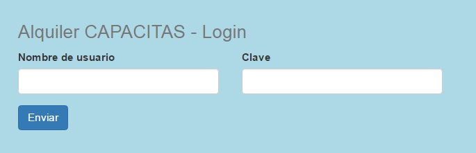

Instituto Superior Capacitas
----------------------------

Carrera: Analista en Sistemas

Año: 1ro.

Asignatura: Práctica profesionalizante

Profesor: Passalacqua, Lucas

Apellido y nombre del alumno: Ronacher, Stefan

Título del trabajo: Alquiler Capacitas

Fecha de entrega: 29/11/2016

<h2>Alquiler Capacitas</h2>
<h3>Descripción</h3>
Éste proyecto administra los recursos de varios tipos que posee una empresa de alquiler.
<h3>Manual de usuario</h3>
Al completar formularios notará que hay validación de datos.
<h4>Login</h4>
Al abrir la url del sitio aparece la pantalla de Login:

Hay que ingresar nombre de usuario y clave para ingresar al sistema.
<h4>Logout</h4>
Para salir del sistema hacer click en "Logout" ubicado en el encabezado de la página:

<h4>Cambiar clave</h4>
Para cambiar clave hacer click en "Cambiar clave" ubicado en el encabezado de la página:

<h4>Sección clientes</h4>
 - Al clickear en "Clientes" aparece un listado de los clientes ingresados:

 - Para editar un cliente clickear "M" de la primera columna
	Aparecerá un formulario para modificar los datos del cliente:
	 
 - Para borrar un cliente clickear "B"de la primera columna.  
Se borrará el cliente de la base de datos.
 - Para crear un cliente nuevo clieckear el "+" de arriba a la derecha.
Aparecerá un formulario para ingresar los datos del cliente:
 
<h4>Sección Recursos</h4>
 - Al clickear en "Recursos" aparece un listado de los recursos ingresados:

 - Para editar un cliente clickear "M" de la primera columna.
Aparecerá un formulario para modificar los datos del recurso:
 
 - Para borrar un cliente clickear "B"de la primera columna.  
 Se borrará el recurso de la base de datos.
 - Para crear un recurso nuevo clickear el "+" de arriba a la derecha.
Aparecerá un formulario para ingresar los datos del recurso:
 
<h4>Sección alquileres</h4>
Al clickear en "Alquileres" aparece un listado de los alquileres ingresados:

 - Para editar un alquiler clickear "M" de la primera columna
Aparecerá un formulario para modificar los datos del alquiler:

 - Para borrar un alquiler clickear "B"de la primera columna.  
 Se borrará el alquiler de la base de datos.
 - Para crear un alquiler nuevo clickear el "+" de arriba a la derecha.
Aparecerá un formulario para ingresar los datos del alquiler:

<h3>Guía de Instalación (Programadores)</h3>
<h4>Requerimientos</h4>
 - Apache
 - MySql
 - PHP
<h4>Instalación</h4>
 - Copiar archivos al DOCUMENT_ROOT
 - Ejecutar los 2 scripts del directorio sql:
	 - crearEstructura.sql
	 - insertarDatos.sql

En ése orden
¡y Voilá!